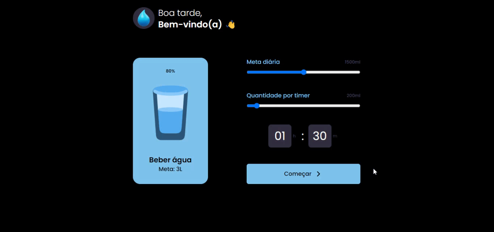

# Water Reminder

In this challenge, a reminder was developed to motivate you to drink water. The application is also responsive. The design was sourced from Rocketseat's [#boraCodar challenge 35](https://www.figma.com/community/file/1278710249415753889/Reminder-Beber-%C3%81gua-%E2%80%A2-Desafio-35) . 

[🔗 Click here to access](https://gabrielli-lima.github.io/water-reminder/)

## 🛠️ Technologies

- ReactJS
- Typescript
- Tailwind CSS
- Material UI
  
## How to run the Project:

### Installation
- `npm install`

### For running the project
- `npm run dev`